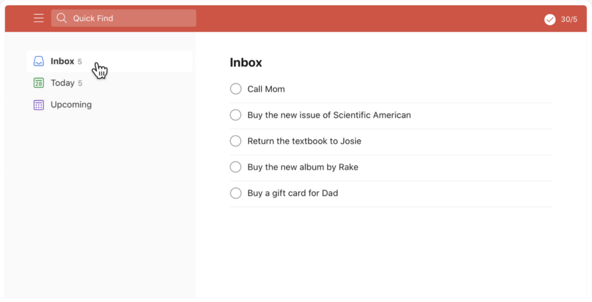

# Assignment 1: Build the Look and Feel of a Task Manager
## INFO 153A/253A Front-End Web Architecture

**Points:** 100 points  
**Individual Assignment**

---

## Overview

Create the look and feel of a task manager using HTML5 and CSS3. This assignment focuses on building a responsive, semantic web interface that replicates the provided design mockup.

---

## Learning Objectives

By completing this assignment, you will:
- Build semantic HTML5 structure using appropriate elements
- Implement responsive CSS layouts using Flexbox, CSS Grid, or Floats
- Create accessible form elements and interactive components
- Apply modern CSS styling techniques and best practices
- Understand mobile-first responsive design principles

---

## Design Mockup

Your task manager should replicate the following design:



The interface consists of three main sections:
1. **Header** - Red navigation bar with search and menu functionality
2. **Left Navigation** - Sidebar with task categories and counts
3. **Main Content** - Task list display area

---

## Requirements

### General Specifications (15 points)

#### Typography & Layout
- **Font Family**: Roboto throughout the entire site
- **Base Font Size**: 14px
- **Left Navigation Width**: 300px
- **Responsive Behavior**: Left navigation disappears on viewports 480px or less
- **Layout Method**: Choose one: Floats, Flexbox, or CSS Grid

#### Semantic HTML Requirements
- Use semantic HTML5 elements appropriately (`<header>`, `<nav>`, `<main>`, `<section>`, etc.)
- Implement proper heading hierarchy
- Use unordered lists for navigation and task items
- Separate content from presentation

---

### Header Section (15 points)

#### Visual Specifications
- **Background Color**: `#dc4c3e`
- **Text Color**: `#ffffff`
- **Icons**: Use provided icons from assets zip file (menu, search, check icons)

#### Functional Requirements
- **Quick Find Box**: 
  - Functional text input field
  - Placeholder text: "Quick find"
  - No filtering functionality required (Assignment 2 feature)
- **Menu Icon**: Three horizontal lines (no hide functionality needed yet)
- **Task Counter**: Display "30/5" or similar count on the right side

---

### Left Navigation Section (15 points)

#### Visual Specifications
- **Background Color**: `#fefbf2`
- **Main Font Color**: `#000000`
- **Task Count Color**: `#7e7d79`
- **Task Count Font Size**: 12px

#### Content Requirements
- **Navigation Items**:
  - Inbox (with count: 5)
  - Today (with count: 5)  
  - Upcoming (no count shown)
- **Icons**: Use only the provided icons from assets zip file
- **Structure**: Implement using HTML unordered lists
- **Hover States**: Not required for this assignment

---

### Main Content Section (15 points)

#### Visual Specifications
- **Header Text (h1)**: 20px font size
- **Task List**: Implemented using unordered lists
- **Checkboxes**: Circular radio buttons (no images, use CSS styling)
- **Task Items**: Clean, readable list format

#### Content Requirements
- **Section Header**: "Inbox" (h1 element)
- **Task List Items**:
  - Call Mom
  - Buy the new issue of Scientific American
  - Return the textbook to Josie
  - Buy the new album by Rake
  - Buy a gift card for Dad

---

## Technical Requirements

### File Structure
```
your-project/
├── index.html
├── styles.css
└── assets/
    ├── menu-icon.png
    ├── search-icon.png
    ├── check-icon.png
    ├── inbox-icon.png
    ├── today-icon.png
    └── upcoming-icon.png
```

### Responsive Design Requirements
- **Desktop (>480px)**: Full layout with visible sidebar
- **Mobile (≤480px)**: Hide left navigation, maintain header and main content
- **Flexible Layout**: Content should adapt smoothly to different screen sizes

### Code Quality Standards
- **External Stylesheet**: All CSS in separate `styles.css` file
- **Semantic HTML**: Proper use of HTML5 semantic elements
- **Clean Code**: Well-organized, commented CSS
- **Proper Classes/IDs**: Meaningful naming conventions

---

## Deliverables

### Required Files
1. **index.html** - Complete HTML structure
2. **styles.css** - All styling and responsive design
3. **assets/** - Copy of provided icon assets

### Submission Requirements
- Upload complete project folder to course submission system
- Ensure all files are properly linked and functional
- Test responsive behavior at 480px breakpoint
- Validate HTML and CSS for errors

---

## Grading Rubric

### Header Specifications (15 points)
- **Font Size** (2 pts): Correct typography implementation
- **Colors** (4 pts): Accurate color matching (#dc4c3e background, #ffffff text)
- **Icons** (5 pts): Proper use of provided assets
- **Quick Find Box** (4 pts): Functional input field with appropriate styling

### Left Navigation Specifications (15 points)
- **Font Size** (2 pts): Correct base and count font sizes
- **Colors** (2 pts): Accurate background and text colors
- **Icons** (2 pts): Proper implementation of navigation icons
- **Responsive Hide** (4 pts): Navigation disappears at 480px or less
- **List Structure** (5 pts): Proper use of unordered lists

### Main Content Specifications (15 points)
- **Font Size** (2 pts): Correct h1 and body text sizing
- **Colors** (3 pts): Consistent color scheme
- **List Implementation** (5 pts): Tasks as unordered list items
- **Horizontal Rules** (5 pts): Proper visual separation

### General Layout (15 points)
- **Font Family** (4 pts): Roboto font correctly implemented
- **Layout Method** (5 pts): Effective use of Flexbox/Grid/Floats
- **Section Widths** (6 pts): Accurate 300px sidebar and responsive main area

### Best Practices Implementation (40 points)
- **Semantic HTML5** (15 pts): Proper use of semantic elements over div/span
- **External Stylesheet** (5 pts): CSS properly separated from HTML
- **Content/Presentation Separation** (10 pts): Clean HTML with styling in CSS
- **Classes and IDs** (10 pts): Meaningful, consistent naming conventions

**Total: 100 points**

---

## Tips for Success

### Development Strategy
1. **Start with HTML Structure**: Build semantic markup first
2. **Add Basic Styling**: Get layout working before details
3. **Test Responsiveness**: Check 480px breakpoint frequently
4. **Validate Code**: Use HTML/CSS validators to catch errors

### Common Mistakes to Avoid
- Using `<div>` instead of semantic elements
- Forgetting to test mobile responsive behavior
- Using images for circular checkboxes instead of CSS
- Mixing layout methods (pick one: Flexbox, Grid, or Floats)

### CSS Organization Tips
```css
/* Use clear section comments */
/* ========== HEADER STYLES ========== */
.main-header { /* styles */ }

/* ========== NAVIGATION STYLES ========== */
.sidebar { /* styles */ }

/* ========== MAIN CONTENT STYLES ========== */
.main-content { /* styles */ }

/* ========== RESPONSIVE STYLES ========== */
@media (max-width: 480px) { /* mobile styles */ }
```

---

## Resources

### Required Reading
- Modern HTML & CSS 2.0 Sections 2-8 (HTML Structure, CSS Fundamentals, Layout)
- MDN Web Docs: HTML5 Semantic Elements
- CSS Grid vs Flexbox: When to use which

### Tools & Validation
- **HTML Validator**: [W3C Markup Validator](https://validator.w3.org/)
- **CSS Validator**: [W3C CSS Validator](https://jigsaw.w3.org/css-validator/)
- **Browser DevTools**: For responsive testing and debugging
- **Can I Use**: For checking CSS feature support

### Getting Help
- Office hours for layout and responsive design questions
- Class discussion for HTML semantic structure guidance
- Online documentation for CSS properties and values

---

## FAQ

**Q: Can I use a CSS framework like Bootstrap?**  
A: No, this assignment requires writing custom CSS to demonstrate your understanding.

**Q: Do the checkboxes need to actually function?**  
A: They should be clickable but don't need to save state. Functionality comes in Assignment 2.

**Q: What if the provided icons don't match exactly?**  
A: Use the provided assets as-is. Visual approximation is acceptable.

**Q: Can I add extra features or styling?**  
A: Focus on meeting requirements first. Small enhancements are fine after core functionality.

---

*This assignment builds the foundation for Assignment 2, where you'll add React interactivity to this static interface.*